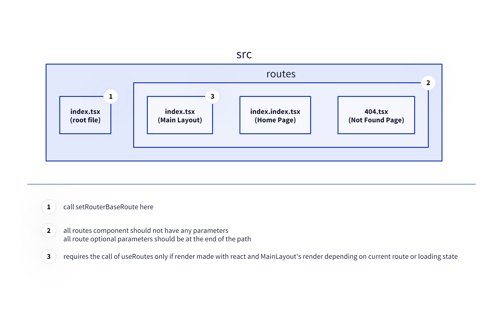

**This branch is provide the installation through a zip extraction. But it should not be needed anymore since package installation is now working.**

# Easy-React-Router

`Easy-React-Router` is an implementation of a file based Router for React.

_(It also works with Preact.)_

This project also includes [`Lazy-Component-Loader`](#lazy-component-loader) which automatically changes the import of components to lazy imports only by renaming the file with a `.lazy.tsx` extension.

### [Try it online](https://nicolasventer.github.io/Easy-React-Router/)


## Features

- fully typed
- file based routing
- dynamic routes (with optional and mandatory parameters)
- automatic not found page
- route layout
- accessors for:
  - route parameters (optional and mandatory)
  - route path
  - route visibility
  - route loading state
- route specialization
- route link component
- optional use of document transition API
- manual route loading
- local router instance (see example in [src/routes/about.tsx](src/routes/about.tsx))

## File based routing

This table shows the equivalence between routes and their respective path.

`/` in `File path` is `routes` directory.

| File path                         | Route Path                         | Example                     |
| --------------------------------- | ---------------------------------- | --------------------------- |
| `/` `index.tsx`                   | layout for `/`                     | `/`                         |
| `/` `index.index.tsx`             | `//`                               | _(hidden path)_             |
| `/` `index$id.tsx`                | `:id` _(`id` is optional)_         | `/?id=abc`, `/?id=123`, `/` |
| `/` `index.$id.tsx`               | `/:id` _(`id` is mandatory)_       | `/abc`, `/123`              |
| `/` `$id.tsx`                     | `/:id` _(`id` is mandatory)_       | `/abc`, `/123`              |
| `/` `404.tsx`                     | not found at `/`                   | _(automatic path)_          |
| `/` `(ignored-path).about.tsx`    | `/about`                           | `/about`                    |
| `/` `(ignored-path)/` `about.tsx` | `/about`                           | `/about`                    |
| `/` `posts.tsx`                   | layout for `/posts`                | `/posts`                    |
| `/` `posts/` `index.tsx`          | layout for `/posts`                | `/posts`                    |
| `/` `posts/` `index.index.tsx`    | `/posts//`                         | _(hidden path)_             |
| `/` `posts$id.tsx`                | `/posts:id` _(`id` is optional)_   | `/posts?id=abc`, `/posts`   |
| `/` `posts.$id.tsx`               | `/posts/:id` _(`id` is mandatory)_ | `/posts/abc`, `/posts/123`  |
| `/` `posts/` `$id.tsx`            | `/posts/:id` _(`id` is mandatory)_ | `/posts/abc`, `/posts/123`  |
| `/` `posts.3.tsx`                 | `/posts/3`                         | `/posts/3`                  |
| `/` `posts/` `404.tsx`            | not found at `/posts`              | _(automatic path)_          |
| `/` `(ignored-file).tsx`          | _(no path)_                        | _(no path)_                 |

_If you weirdly need `/404` in your path, create a folder named `404`. Same for `index`._

## Installation

### With package (recommended)

Download [vite-plugin-watch-0.4.0.tgz](vite-plugin-watch-0.4.0.tgz?raw=true) and [easy-react-router-1.0.0.tgz](easy-react-router-1.0.0.tgz?raw=true).

```bash
bun install easy-react-router-1.0.0.tgz
```

Add `routerPlugin` to `vite.config.ts`:

```ts
import react from "@vitejs/plugin-react";
import { routerPlugin } from "easy-react-router/plugin";
import { defineConfig } from "vite";

export default defineConfig({
	plugins: [react(), routerPlugin()], // some parameters can be passed to routerPlugin
});
```

Add `genHtml` to `package.json`:

```json
{
	"scripts": {
		"genHtml": "bun run ./node_modules/easy-react-router/build/plugin/_genRoutes.ts --html dist/index.html"
	}
}
```

### With zip

Download [EasyReactRouter.zip](EasyReactRouter.zip?raw=true) and extract it in your project.

The archive contains a folder name `z_ToCopy`. **Merge the content** of each file with the corresponding file in your project. **Do not replace the files.**

### Usage

If `routes` folder does not exist, the plugin will create it with some example files.  
And then, you can update the content of `index.tsx` file to render the `MainLayout` component:

```tsx
import { StrictMode } from "react";
import { createRoot } from "react-dom/client";
import { MainLayout } from "./routes";

createRoot(document.getElementById("root")!).render(
	<StrictMode>
		<MainLayout />
	</StrictMode>
);
```

For building, execute:

```bash
bun run genHtml
```

_(command to manually add to `package.json` that can be customized)_

<details>
<summary>Alternative</summary>

Alternatively, you can create a typescript file with the following content:

```ts
import { genHtmlRoutes } from "easy-react-router/plugin";
await genHtmlRoutes({ htmlFile: "dist/index.html" }); // the html file is copied to generate the static routes
```

Other functions are available in the plugin...

```ts
import { genLazyComponent, genRouterInstance } from "easy-react-router/plugin";
await genRouterInstance(); // generate the router instance
await genLazyComponent(); // generate the lazy components
```

</details>

## Documentation

### Structure



### genRoutes

- [\_genRoutes.ts](_genRoutes.ts) generates the [Router Instance](src/routerInstance.gen.ts) according to the file structure (c.f [File based routing](#file-based-routing)).
- Only changes in `src/routes` are watched.
- A path is generated only when there is at least one export.
- All routes are lazy loaded.
- <details>
  <summary>More...</summary>

  - if many exports, add `// @routeExport` comment to specify the export to use for the route.
  - use `--json` to additionally generate a JSON file with the result of the parsing
  - use `--force` to force the regeneration of the router instance

  **Note:** The Main Layout Component is generally lazy exported since it is imported in the [root file](src/index.tsx) (to avoid a build warning). In this case, the `// @routeExport` comment is needed.
  </details>

### Router Instance

- `RouterRender`: Component that renders the current route. Parameter `subPath` is used to specify the layout to use (and the routes to render).
- `navigateToRouteFn`: Function to navigate to a route, using the current useTransition setting.
- `getRouteParams`: Function to get the current route parameters.
- `currentRoute`: Getter to get the current route.
- `RouterPathType`: Type of the path of the routes (only the public ones).
- `RouterParamsType`: Type of the parameters of a route.
- `useRoutes`: Hook to force the re-render of a component that renders depending on the current route or loading state.
- `setRouterBaseRoute`: Function to set the base route of the router (useful in production when the app is not at the root of the domain).
- <details>
  <summary>More...</summary>

  - `isRouteLoaded`, `isRouteLoading`, `isRouteVisible`: Functions to check the state of a route.
  - `notFoundRoute`: Route that is rendered when no route is found.
  - `loadRouteFn`: Function to trigger the loading of a route (could be use on hover for example).
  - `RouteLink`: Component to create a link to a route.
  - `navigateToCustomRouteFn`: Function to navigate to a custom url and update the current route.
  - `RouteCustomLink`: Component to create a link to a custom url.
  - `setUseRouteTransition`: Function to set the use of the document transition API.
  - `updateCurrentRoute`: Function that updates the current route according to the current url.
  - `buildRouteLink`: Function to build a link to a route.
  </details>

### Deployment

After building the project, execute `bun run genHtml` (with the correct path to the `index.html` file).
This will generate a [`staticRoutes.yaml`](staticRoutes.yaml) file that will be used to generate copies of the `index.html` file with the correct paths.  
You can manually edit the `staticRoutes.yaml` file to add more routes.  
By default, the `staticRoutes.yaml` file is not overwritten. Use the `--overwrite` flag to overwrite it  
(like this: `bun run genHtml -- --overwrite`). (The `--` is needed to pass the flag to the script.)

# Lazy-Component-Loader

`Lazy-Component-Loader` is a tool that automatically changes the import of components to lazy imports only by renaming the file with a `.lazy.tsx` extension.

## Features

- fully typed
- automatic update of imports
- loading state
- manual loading

## Usage

- Export only components from the file.
- Rename the file with `.lazy.tsx` extension.
- That's it!

**Notes:** Be careful to not export `load` or `loadingState` as they are used by the loader.
